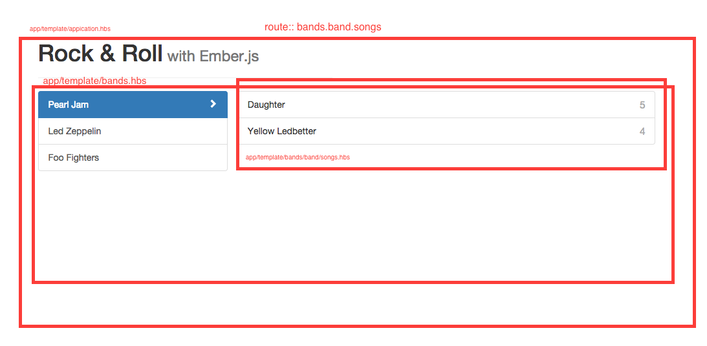

master detail view is a UI pattern by which column one lists a canonical dipslay of data e.g. bands column 2 lists the songs of bands.  creating an assoication of bands having songs and the viewable songs being the product or child of the current selected band.

ember accomplishes this by filtering the model via passing the model from parent route to its child and applying a segment filter at each level.

e.g.  songs route is passed a band by slug segment that is a filter of all bands.
<div><br></div>
##router
```js
Router.map(function() {
    this.route('bands', function(){
		this.route('band', {path: ':slug'}, function(){
			this.route('songs');
		});
	});
});
```
##route (bands)
The origin route loads all bands
```js
export default Ember.Route.extend({
    model: function() {
        return bands;
    }
});
```
##template (bands)
the outlet in bands.hbs will automatically call app/template/bands/index.hbs  in this template we indicate the user to select a band from column one
### bands.hbs (app/template/bands.hbs)
This template displays all bands with link to bands.band.songs to view songs for selcted band
```hbs
<div class="col-md-4">
  <div class="list-group">
    {{#each model as |band|}}
      {{#link-to "bands.band.songs" band class="list-group-item band-link"}}
        {{band.name}}
        <span class="pointer glyphicon glyphicon-chevron-right"></span>
      {{/link-to}}
    {{/each}}
  </div>
</div>
<div class="col-md-8">
  <div class="list-group">
    {{outlet}}
  </div>
</div>
```
### index.hbs  (app/template/bands/index.hbs)
this is displayed by default in the outlet of bands.hbs
```hbs
<div class="list-group-item empty-list">
	<div class="empty-message">
		Select a band.
	</div>
</div>
```

##route (band)
band is accesses the parent model via modelFor and filters by slug segment in url

/bands/EathWindFire
```js
export default Ember.Route.extend({
	model: function(params){
		var bands = this.modelFor('bands');
		return bands.findBy('slug', params.slug);
	}
});
```
###template (app/template/bands/band.hbs)
```hbs
{{outlet}}
```
###template (app/template/bands/band/index.hbs)
url bands/pearl-jam/
this will show select a band as in this current view we're not showing any specific information. we could show information about the band and them show a button for songs or some such or in the named output call the route for songs and display it all on the same page.
```hbs
<div class="list-group-item empty-list">
	<div class="empty-message">
		Select a band.
	</div>
</div>
```
##route (songs)
songs again accese the parent modle via modelFor and fetches all assoiated songs.
```js
export default Ember.Route.extend({
	model: function(){
		return songs;
	}
});
```
##template
```js
<div class="row">
  <ul class="list-group songs">
    {{#each model.songs as |song|}}
      <li class="list-group-item song">
        {{song.title}}
        <span class="rating pull-right">{{song.rating}}</span>
      </li>
    {{/each}}
  </ul>
</div>

```